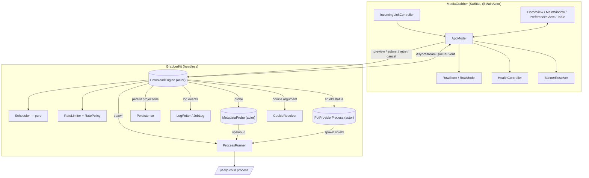
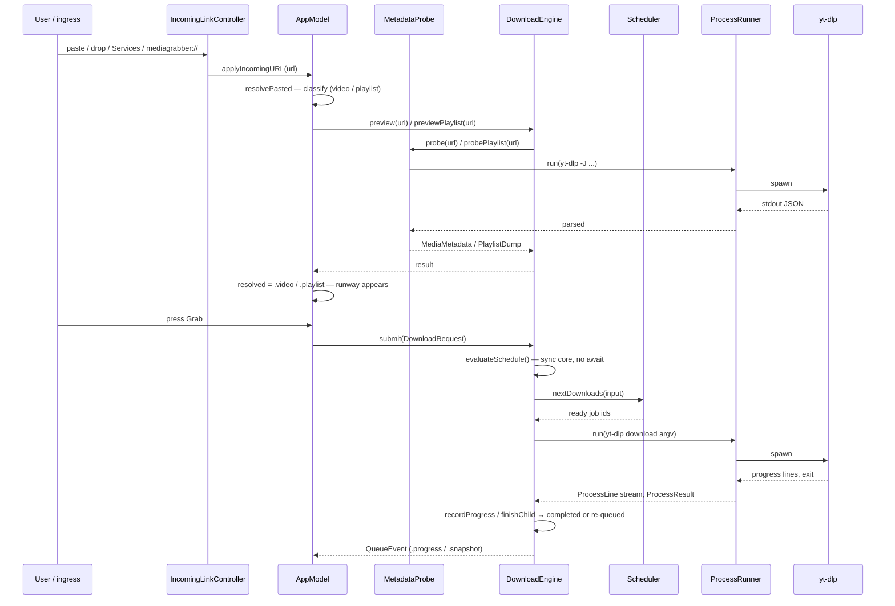
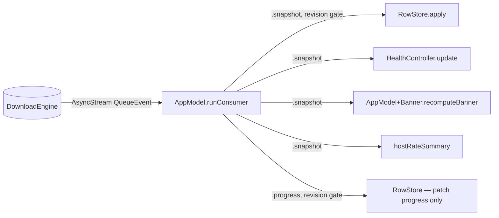
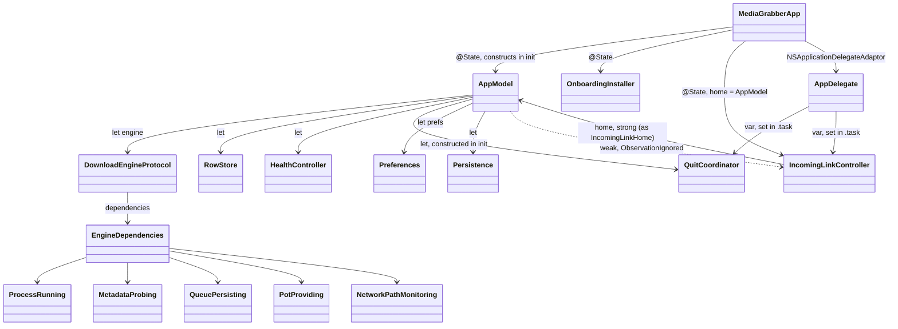
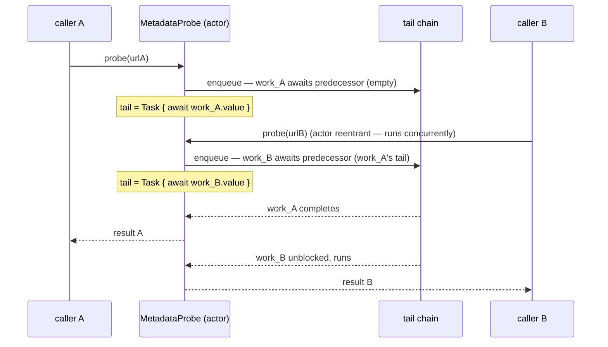

# Architecture — HLD and LLD

What's shipped through Phase 9 (add flows). Two targets:
`GrabberKit` (headless, no SwiftUI, `Sources/GrabberKit/`) and `MediaGrabber`
(SwiftUI app, `Sources/App/`).

Pairs with [`docs/state-flow.md`](state-flow.md) — that doc owns the job /
per-host-rate / shield **state machines** in full (every transition, every
trigger); this doc does not repeat them, only shows where they sit in the
bigger picture. Revisit both together when a phase changes a component
boundary or adds a state.

---

## 1. High-level design

### 1.1 Component map

**GrabberKit**

| component | shape | responsibility |
|---|---|---|
| `DownloadEngine` | `actor` | Owns `[DownloadJob]`, revision counter, queue halt, deferrals, rate limiter, network/shield status; the only writer of job state. `Sources/GrabberKit/Download/DownloadEngine.swift` + extensions (`+Launch`, `+Mutations`, `+State`, `+RateControl`, `+Deferral`, `+Preview`, `+Retry`, `+Helpers`). |
| `Scheduler` | pure `enum` | `nextDownloads` / `nextProbe` over a `SchedulerInput` value — no engine state, no side effects. `Download/Scheduler.swift`. |
| `RateLimiter` + `RatePolicy` | `struct` + pure `enum` | Per-host `RateState` machine + the global adaptive-concurrency cap. State machine detail: `docs/state-flow.md` §2. `RateLimiting/`. |
| `MetadataProbe` | `actor` | Serializes and runs `yt-dlp -J` probes (single video or `--flat-playlist`). `Download/MetadataProbe.swift`. |
| `ProcessRunner` | `struct` | The **only** place `Foundation.Process` is touched. Spawns, drains stdout/stderr, reports exit + cancellation. `Onboarding/ProcessRunner.swift`. |
| `Persistence` | `final class` | Debounced JSON writer: queue, history, columns, playlist groups. `Model/Persistence.swift`. |
| `LogWriter` / `JobLog` | — | Structured `LogEvent` stream + one raw transcript file per job. `Logging/`. |
| `PotProviderProcess` | `actor` | Owns the bot-check "shield" child process. State machine detail: `docs/state-flow.md` §3. `PotProvider/`. |
| `CookieResolver` | pure `struct` | Resolves a browser cookie source to a yt-dlp argument. `Cookies/`. |

**App**

| component | shape | responsibility |
|---|---|---|
| `IncomingLinkController` | `@MainActor @Observable` | Owns every external URL ingress (clipboard, drag, Services, `mediagrabber://`) for the app's life. `App/Ingress/`. |
| `AppModel` | `@MainActor @Observable` | The app's view-model. Split across `AppModel.swift` (core, consumer loop), `AppModelPlaylist.swift`, `AppModelRowActions.swift`, `AppModelDialogs.swift`, `AppModel+Banner.swift`, `AppModelIncomingLink.swift`. |
| `RowStore` / `RowModel` | `@MainActor @Observable` | Converts `QueueEvent` into filtered, sorted, diffed UI rows. `App/Rows/`. |
| `HealthController` | `@MainActor @Observable` | Derives `HealthChip`s (shield / online / host-rate) from `QueueSnapshot`. `App/Chrome/`. |
| `BannerResolver` | pure functions | Priority-resolves the one banner shown, if any (`depMissing > networkDown > circuitOpen > potProviderDown`). `App/Chrome/BannerResolver.swift`. |

### 1.2 Request path — paste to download

Every add-flow ingress (clipboard, drag, Services, URL scheme) and a manual
paste converge on the same path from `AppModel.resolvePasted` onward — one
pipeline, no second route to a download.

`DownloadEngine.evaluateSchedule()` is the scheduling core: it reads
`jobs`/`rateLimiter`/`deferrals` synchronously and calls the pure `Scheduler`
with no `await` in between, so no other actor-isolated call can interleave
mid-decision. See `docs/state-flow.md` for the full job-state and
host-rate-state machines this path drives.

### 1.3 Snapshot / event path — engine to UI

`DownloadEngine` emits two kinds of `QueueEvent` on one `AsyncStream`:
`.snapshot(QueueSnapshot)` (full job list + `revision` + queue halt + host-rate
summary + online + shield status, after every structural mutation) and
`.progress([UUID: Progress], revision:)` (a delta map, much higher frequency,
no full rebuild). Both consumers gate on `revision >= lastRevision` to drop
stale or duplicate events — the coalescing mechanism that keeps a
fast-progressing download from thrashing the UI. `RowStore` further only
recomputes its visible/sorted list when something sort- or bucket-relevant
actually changed; `RowModel.patch` diffs field-by-field so unaffected derived
strings (`statusText`, `speedText`) are not recomputed on every tick.

`AppModel.runConsumer()` is a `for await event in engine.events` loop; if the
stream ever ends it logs, sleeps, and does a hard resync from
`engine.currentSnapshot()` — a self-healing reconnect rather than a crash.

### 1.4 Persistence path

Every structural mutation (`bump()` + `emitSnapshot()`) also calls
`persistProjections()`, which hands `Persistence` the active (non-terminal)
and terminal `PersistedJob` sets. `Persistence` stashes them into an
in-memory pending struct synchronously, then debounces (0.5s) a single
`writePending()` that reconciles cached vs on-disk state and writes JSON —
`queue.json` (active jobs, columns, playlist groups) and history (terminal
jobs, capped at 200, oldest evicted). On launch, `AppModel.performLaunchSetup`
loads both files, calls `engine.restore(active:history:)`, and the restored
`.queued` jobs immediately re-enter `evaluateSchedule()`.

Live/transient states clamp to `.queued` on write (`.running`, `.probing`,
`.waitingForNetwork`, `.cooldown` → `.queued`) so a killed app resumes
cleanly; a `.failed(ErrorClass)` degrades to `.failed(reason: String)` on
persist — the original `ErrorClass` case does not round-trip through a
restore. `JobLog` (one raw transcript file per job) persists separately,
evicted alongside the same 200-job terminal cap.

### 1.5 Config path

`Preferences` is `@Observable`, backed directly by `UserDefaults`. The engine
holds a live reference and reads it **at the point of use**, not cached —
`cap` reads `preferences.maxConcurrentDownloads` on every scheduling pass, and
`launchDownload` reads `proxyURL` / `forceIPv4` / `speedLimitKBps` /
`cookiesFromBrowser` at the moment a process is spawned. A preference change
therefore applies to the next scheduling pass or the next launched job, never
retroactively to a process already running.

`EngineTuning` is a separate, mostly-static surface (rate-limit thresholds,
backoff ladder, fragment counts, metadata-probe limits), resolved once from
environment variables via `EngineTuning.resolved()` and threaded through
`EngineDependencies.tuning`. See `docs/state-flow.md` §2 for its fields and
defaults.

---

## 2. Low-level design

### 2.1 Ownership graph

`MediaGrabberApp.init()` builds the whole graph in dependency order:
`Preferences` → `OnboardingInstaller` → resolve `ytDlpURL` → `LogWriter` →
`Persistence` (needs `log`) → `EngineDependencies.live(...)` (needs
`ytDlpURL`, `log`, `persistence`) → `DownloadEngine(dependencies:preferences:)`
→ `AppModel(engine:installer:prefs:log:persistence:columnConfig:)`. The
`IncomingLinkController` is built last, holding `AppModel` strongly as its
`IncomingLinkHome`; `AppModel` holds it back only as
`@ObservationIgnored weak var` — the one deliberate weak edge, breaking what
would otherwise be a retain cycle.

`AppModelConfirmer` (the `Confirming` seam `QuitCoordinator` uses) is
constructed inside `AppModel.init` holding `weak var model: AppModel?`, set to
`self` only after `AppModel` finishes initializing — a two-step construction
to avoid capturing a not-yet-valid `self`.

### 2.2 The actor boundary

Three actors: `DownloadEngine`, `MetadataProbe`, `PotProviderProcess`.
`DownloadJob` (the engine's mutable job model) is a plain class isolated by
convention — only ever touched from `DownloadEngine`-isolated methods — and is
deliberately **not** `@MainActor @Observable`; `JobSnapshot` is the
`Sendable` value type the UI actually binds to. Everything on the App side
(`AppModel`, `RowStore`, `RowModel`, `HealthController`,
`IncomingLinkController`, `OnboardingInstaller`) is `@MainActor @Observable`.

The engine never calls into `@MainActor` code directly. The boundary crossing
is entirely: **actor emits `Sendable` values on an `AsyncStream`, a
`@MainActor` consumer pulls them.** `AppModel.runConsumer()` is `@MainActor`
by virtue of being a method on a `@MainActor` class; its `for await` loop
resumes on the main actor without any explicit `Task { @MainActor in }` hop.
The one explicit hop in the shipped code is `AppDelegate`'s clipboard-poll
`Timer` callback (`Timer` is not actor-isolated), which wraps its body in
`Task { @MainActor in ... }`.

Actors are **reentrant across `await`** — a naive `probe()` could let two
calls interleave their yt-dlp launches. `MetadataProbe` serializes explicitly
with a tail-`Task` chain: each `enqueue` call captures the current `tail`,
builds a new `work` Task that first awaits the predecessor, then runs; `tail`
is reassigned to await the new `work`. This gives FIFO ordering without a
lock, and a cancelled predecessor still lets the chain advance (see
`docs/state-flow.md`'s note on the `MetadataProbePlaylistTests` cancel tests,
which exercise exactly this).

### 2.3 Async seams / injection points

`EngineDependencies` (`Download/DownloadEngineProtocol.swift`) is the engine's
single injection point — every effectful capability is a protocol existential,
set once at construction, never swapped:

| field | protocol | production (`.live`) |
|---|---|---|
| `runner` | `ProcessRunning` | `ProcessRunner()` |
| `fileManager` | `FileManaging` | `FoundationFileManager()` |
| `probe` | `MetadataProbing` | `MetadataProbe(ytDlpURL:runner:bucket:)` |
| `envProbe` | `EnvironmentProbing` | `EnvironmentProbe()` |
| `clock` | `any Clock` | `SystemClock()` |
| `networkMonitor` | `NetworkPathMonitoring` | `AlwaysOnlineMonitor()` by default |
| `potProvider` | `PotProviding` | `PotProviderProcess(installer:runner:pinger:tuning:log:)` |
| `persistence` | `QueuePersisting` | caller-supplied `Persistence` |
| `log` | `LogWriter?` | caller-supplied |

`DownloadEngineProtocol` itself (`Sendable`, every method `async`) is what
`AppModel` actually depends on (`let engine: DownloadEngineProtocol`) — tests
substitute a fake engine wholesale rather than faking each dependency.
`IncomingLinkHome` is the same pattern one layer up: `IncomingLinkController`
depends on the protocol, not the concrete `AppModel`, so it needs no import of
the App target's view-model type.

### 2.4 Event-stream mechanics

`DownloadEngine.init` creates `AsyncStream<QueueEvent>.makeStream()` once;
the stream is exposed as a `nonisolated let` (safe — `AsyncStream` is
`Sendable`) while only the actor itself ever calls `.yield`/`.finish` on the
continuation. Default (unbounded) buffering — not overridden. Nothing in the
shipped code ever calls `.finish()`; the stream lives for the engine's
lifetime, which is the app process's lifetime.

Every mutation bumps `revision` (an actor-isolated `UInt64` counter) before
emitting. Both consumers (`RowStore.apply` in production, `EventCollector` in
tests) gate on `revision >= lastRevision` — this is what makes the stream
resilient to duplicate or out-of-order delivery, not a queue-depth throttle.

### 2.5 Key value types

| type | role |
|---|---|
| `JobSnapshot` | Immutable, `Sendable`, `Identifiable` UI-facing projection of a `DownloadJob` — id, url, rateHost, title, state, progress, kind, timestamps, output files, available actions. |
| `QueueSnapshot` | Full-queue broadcast: jobs, revision, queue halt, host-rate summary, online, shield status. |
| `DownloadRequest` | The user's download intent (url, destination, kind, container, filename template, audio language) — `Codable`, persisted inside `PersistedJob`. |
| `ResolvedLink` | App-layer probe result: `.video(MediaMetadata)` or `.playlist(PlaylistDump)`. |
| `MediaMetadata` | Single-video probe result — title, duration, extractor, format availability, video heights, audio tracks. |
| `PlaylistDump` / `PlaylistEntry` | Playlist probe result, decoded from yt-dlp's flat-playlist JSON. |
| `RunwayOverrides` | User-adjusted kind / destination / audio-language overrides layered onto the runway's seeded defaults before building a `DownloadRequest`. |
| `ErrorClass` | The failure taxonomy (17 cases) each `LogEvent`, retry gate, and UI sentence is keyed off. |
| `FailurePresentation` | One user-facing sentence + the offered row actions, derived per `ErrorClass`. |
| `SubmitResult` | `.queued(UUID)` or `.duplicateExists(existing:wasCompleted:)`. |
| `PersistedJob` | `Codable` disk projection of a job; live states clamp to `.queued` on write. |
| `RateState` / `HostRateDisplayState` | Per-host rate machine state and its UI-safe display projection — full detail in `docs/state-flow.md` §2. |

### 2.6 Process / child-process rules

`ProcessRunner` is the **only** place `Foundation.Process` is touched — every
other spawn (metadata probe, shield server, onboarding installs) goes through
the same `ProcessRunning` seam, but each owner builds its own `ProcessLaunch`;
`DownloadEngine` is the sole caller of the actual **download** argument
builder, so there is exactly one code path that can start a yt-dlp download.

Each spawned process is drained by two dedicated background threads (one per
pipe) doing blocking reads, each feeding a line splitter into the
`AsyncStream<ProcessLine>`; the stream only finishes once **both** readers hit
EOF, so a race between stdout and stderr closing at different times can never
drop output. A third thread waits on the process and publishes the exit
result. Cancelling the awaiting Task sends `SIGTERM`
(`Process.terminate()`) and the resulting `ProcessResult.wasCancelled` flag is
how the engine tells "we killed it" apart from "it genuinely failed" — see
`docs/state-flow.md`'s `.running → .waitingForNetwork` / `.cancelled` rows for
where that distinction matters.

---

## 3. See also

- [`docs/state-flow.md`](state-flow.md) — job lifecycle, per-host rate
  limiting, shield status: every state, every transition, every trigger.
- `docs/mockups/screens.html` — the visual reference these components render.
- `ticket-backlog.md` §Documentation — the two docs' scope was decided
  together; keep them beside each other.
