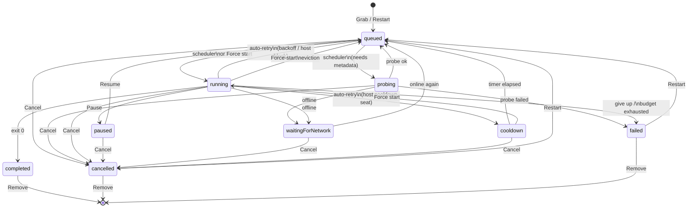
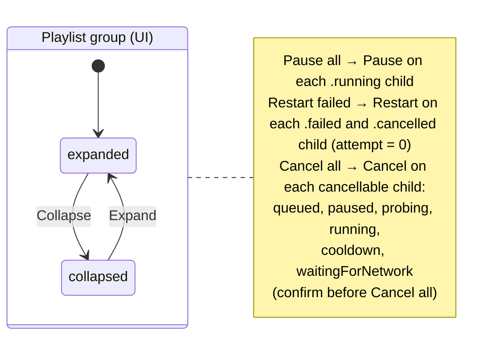

# Job status, rail, and actions

This document describes the final look of the app for job status, Home rail filters, and row / playlist-group actions — not the current codebase and not a changelog.

**Status:** locked 2026-09-12.  
**Owner:** Phase 11 (Home manager chrome).  
**As-shipped engine transitions (today’s code):** `state-flow.md`.

## 1. The nine states (unchanged engine enum)

`JobState`: `queued` · `probing` · `running` · `paused` · `waitingForNetwork` · `cooldown(until:)` · `completed` · `cancelled` · `failed(ErrorClass)`

Row UI shows these **1:1** (plain-language aliases only). No invented display statuses (`retrying`, host-`cooling down` on a `.queued` job, etc.). Extra detail → **Remark**.

| Engine | Row label |
|---|---|
| `queued` | Queued |
| `probing` | Probing |
| `running` | Downloading |
| `paused` | Paused |
| `waitingForNetwork` | Waiting for network |
| `cooldown` | Cooling down |
| `completed` | Saved |
| `cancelled` | Cancelled |
| `failed` | Failed |

**Status column:** kept in Columns menu; **hidden by default** (rail is the everyday filter; column is optional). Labels stay 1:1 with the table above — never free text.

## 2. Rail (filters only — not statuses)

| Rail | Includes |
|---|---|
| **Downloading** | probing, running, queued, paused, waitingForNetwork, cooldown |
| **Done** | completed |
| **Inactive** | failed, cancelled |
| **All** | everything |

Badge on **Inactive** = count of failed + cancelled.

## 3. State diagram (single-video job)



### Notes

- **Cancel** = abandon → `cancelled` (terminal). Same meaning from every non-terminal state that offers it. Wire Cancel on `cooldown` and `waitingForNetwork` (today: advertised, no-op).
- **Cancel on cooldown (Option A):** job → `cancelled`; clear that job’s deferral only. **Host `RateState` unchanged** — siblings stay gated until the host clock expires.
- **Remove** = delete the job entry from persistence (queue/history projection) plus part files and job log — not “cancel then keep in history.”
- **Restart** from `failed` / `cancelled` → `queued` with **`attempt = 0`**. Cookie / sign-in variant only when the failure class offers it. **Not Resume.** No Restart on Saved.
- **Resume** only from `paused`.
- **Force start** from `queued` when not immediately schedulable, or from `cooldown` (not from `waitingForNetwork`). Eviction → oldest running job back to `queued`; **no Remark** on victim or forced job for that event. Confirm when eviction will happen (§6).
- Auto-retry landing in `queued` (deferred) vs `cooldown` is an engine detail; row status stays honest. Backoff / host clock → Remark.
- **`depMissing`:** keep `queueHalt` (nothing schedules); blocking dialog + banner/HealthStrip. Do **not** mass-flip jobs to `paused`. Product copy may say the queue is paused.

## 3b. Playlist group (second diagram)

UI already has expand/collapse (`isCollapsed` + disclosure caret). Group header shows rollup + group actions. Show the group when any child matches the selected rail.

Group actions **compose** the single-job verbs — they do not invent new `JobState`s.



| Group action | Applies to children in | Effect |
|---|---|---|
| **Pause all** | `running` only | each → `paused` |
| **Restart failed** | `failed` + `cancelled` | each → `queued`, `attempt = 0` |
| **Cancel all** | queued, paused, probing, running, cooldown, waitingForNetwork | each → `cancelled` (confirm first) |
| **Collapse / Expand** | header only | hide/show children; header + rollup remain |

## 4. Actions per state (single job)

Only list actions that are **enabled** (offered). Others are absent — not disabled placeholders — unless Phase 11 plan decides otherwise.

| State | Pause | Resume | Cancel | Force start | Restart | Restart with sign-in | Reveal | Remove | Open | Log |
|---|---|---|---|---|---|---|---|---|---|---|
| `queued` | — | — | ✓ | when blocked | — | — | — | ✓ | ✓ | — |
| `probing` | — | — | ✓ | — | — | — | — | ✓ | ✓ | — |
| `running` | ✓ | — | ✓ | — | — | — | — | ✓ | ✓ | ✓ |
| `paused` | — | ✓ | ✓ | — | — | — | — | ✓ | ✓ | ✓ |
| `waitingForNetwork` | — | — | ✓ | — | — | — | — | ✓ | ✓ | ✓ |
| `cooldown` | — | — | ✓ | ✓ | — | — | — | ✓ | ✓ | ✓ |
| `completed` | — | — | — | — | — | — | ✓ | ✓ | ✓ | ✓ |
| `cancelled` | — | — | — | — | ✓ | — | — | ✓ | ✓ | ✓ |
| `failed` | — | — | — | — | ✓ | when offered | — | ✓ | ✓ | ✓ |

### Locked semantics

| Decision | Rule |
|---|---|
| **Remove** | Deletes the entry from the engine’s job list and persistence (`queue.json` / `history.json` projections), part files, and the job log. |
| **Cancel** | Keeps an entry in history as `cancelled`. Distinct from Remove. On cooldown: Option A (host rate unchanged). |
| **Restart** | Always fresh (`attempt = 0`). From `failed` and `cancelled` only. **No Restart on Saved.** |
| **Log** | Offered on `cooldown` and `waitingForNetwork`. Logging must be proper for user inspection and later debugging. |
| **Force start on `queued`** | Only when not immediately schedulable (deferred / host-blocked). Always on `cooldown`. |
| **UI strings** | **Force start**; **Restart**; **Restart with sign-in** (cookie / browser-sign-in path). |

### Deliberate changes vs today

| Change | Why |
|---|---|
| Drop **Pause** on `queued` | Today it’s a no-op; don’t advertise it |
| **Cancel** works on `cooldown` / `waitingForNetwork` | Abandon; stop lying |
| **Restart** on `cancelled` | Same Inactive bucket as failed |
| UI verb **Restart** (engine may still be `retry`) | Matches “no Resume from Inactive” |
| No invented status strings | Remark carries why / when |
| Force start conditional on `queued` | Honesty — not “jump the line” when already next |
| **Restart failed** group action includes cancelled | Same Inactive idea |
| **Cancel all** includes cooldown + waitingForNetwork | Matches per-row Cancel once wired |

## 5. Remark catalog (keep short)

Status = plain label only. Remark = short detail; **empty** when nothing useful. Never invents a second status.

| State | Remark |
|---|---|
| `queued` (normal) | `#N` if behind others; else empty |
| `queued` (deferred / host-blocked) | Short wait reason, e.g. `Host cooling down` / `Try again in 1:00` / `Rate-limited` |
| `probing` | empty |
| `running` | empty (Progress / Speed / ETA) |
| `paused` | empty |
| `waitingForNetwork` | `No connection` |
| `cooldown` | `Try again in 1:00` (countdown OK) |
| `completed` | empty |
| `cancelled` | empty |
| `failed` | Failure sentence only (no `Failed —` prefix) |

No Remark for Force-start eviction (victim or forced job).

Remark surfaces via hover + keyboard focus; optional Columns-menu column; a11y not hover-only.

## 6. Confirmations

| Action | Confirm? |
|---|---|
| **Cancel all** (playlist / batch) | Yes |
| **Cancel** (single) | No |
| **Remove** | Yes when non-terminal, or when Saved with file present (optional suppress) |
| **Force start** (no eviction) | No |
| **Force start** (will evict) | Yes — *Start this now? The oldest download in progress will go back to the queue.* Confirm **Start now** |
| **Restart** / **Restart with sign-in** | No |
| **Quit** | Yes when `hasActiveJobs` or `queueHalt` (existing) |
| **depMissing** | Blocking install/fix dialog (not a Cancel-style confirm) |

## 7. Active jobs (`hasActiveJobs` / quit)

`isActive` stays: **`probing`, `running`, `waitingForNetwork`, `cooldown`**.  
Not active: queued, paused, completed, cancelled, failed.

Used for quit prompt and in-flight motif — **not** the same set as the Downloading rail.

## 8. Phase 12 multi-select (same verbs)

Batch actions use the **same** verbs and eligibility as single-row / playlist group. Apply only to selected rows that offer that action.

| Batch | Eligibility |
|---|---|
| Pause | `running` |
| Resume | `paused` |
| Cancel | cancellable states (incl. cooldown, waitingForNetwork) |
| Restart | `failed` + `cancelled` |
| Remove | selected (same Remove confirm policy) |
| Force start | **only when exactly one selected row is eligible** |

## 9. Rail × state (quick check)

```text
Downloading ── probing, running, queued, paused, waitingForNetwork, cooldown
Done ────────── completed
Inactive ────── failed, cancelled
All ─────────── ∪
```

Phase 11 implements this contract; keep `state-flow.md` as the as-shipped transition encyclopedia until code catches up.
