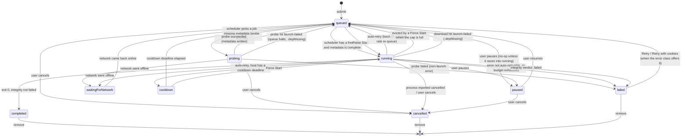
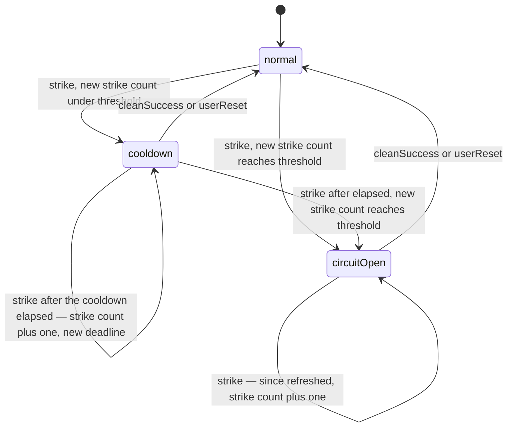
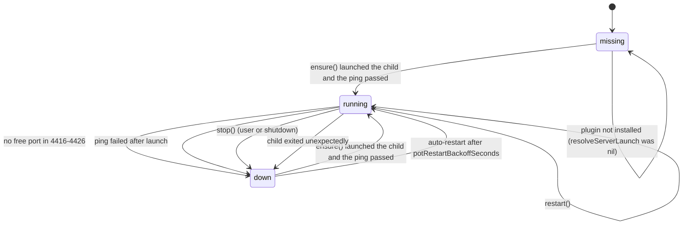

# State flow — job lifecycle and per-host rate limiting

Two state machines drive the download queue, plus a small third for the
bot-check shield. This doc enumerates every state, every transition, and the
trigger for each, and marks what is deferred so the diagrams have room to grow.

Paths are relative to `apps/media-grabber/`. Engine files live under
`Sources/GrabberKit/Download/`, rate files under
`Sources/GrabberKit/RateLimiting/`. Revisit this doc whenever a phase adds a
state.

---

## 1. Job lifecycle (`JobState`)

`JobState` — `Sources/GrabberKit/Download/JobSnapshot.swift`:

`.queued` · `.probing` · `.running` · `.paused` · `.waitingForNetwork` ·
`.cooldown(until:)` · `.completed` · `.cancelled` · `.failed(ErrorClass)`

The engine's mutable model is `DownloadJob`; snapshots expose `JobState` to the
app. Every job is born `.queued` (`DownloadJob.init`) — `submit` returns
`.queued(id)` and then calls `evaluateSchedule()`, which may move the job on in
the same tick.

### Transition detail

| from → to | trigger | where | notes |
|---|---|---|---|
| _(none)_ → `.queued` | any `submit` / playlist enqueue | `DownloadEngine.submit`, `makeJob` | `DownloadJob.init` hard-codes `.queued`. No synchronous follow-on; `evaluateSchedule()` runs next. |
| `.queued` → `.probing` | scheduler picks a job whose title/extractor/duration is missing and the single probe slot is free | `evaluateSchedule` → `Scheduler.nextProbe` → `markProbing` | One probe at a time (`probeInFlight`). Host must not be in `blockedProbeHostIDs`. |
| `.queued` → `.running` | scheduler has a free slot (`effectiveCap − running`) and the job has full metadata | `Scheduler.nextDownloads` → `markRunning` | `effectiveCap = min(rateLimiter.adaptiveCap, cap)`. Excluded if the id is deferred or the host is rate-blocked. `markRunning` clears progress/size, sets `startedAt`, launches. |
| `.queued` → `.running` | user Force Start | `forceStart` | Guard: state is `.queued` or a cooldown state. Evicts the oldest running job if the cap is full. Overrides a host block (logs `hostBlockOverridden`) but does not touch `RateState`. |
| `.queued` → `.cancelled` | user cancels | `cancel` (`.queued, .paused` arm) → `markCancelled` | Sets `finishedAt`, enforces the terminal cap. |
| `.queued` → `.paused` | user pauses | `pause` | `pause` guards `state == .running`, so on a pure `.queued` job this is a no-op affordance. |
| `.probing` → `.queued` | probe succeeded | `recordProbeResult(.success)` | Writes title/extractor/duration. `defer` runs `evaluateSchedule()`, so the job can go straight to `.running`. |
| `.probing` → `.failed` | probe failed (non-launch error) | `recordProbeResult(.failure)` | `MetadataError` maps: `.network → .networkDown`, `.botCheck → .botCheck`, `.hostBlocked → .rateLimited`, others → `.unknown`. Terminal — there is no auto-retry from a probe. |
| `.probing` → `.queued` (+ `queueHalt = .depMissing`) | probe hit `launch failed:` / exit 127 | `recordProbeResult` → `haltForDepMissing` | The whole scheduler halts until `revalidate()` clears `.depMissing`. |
| `.probing` → `.waitingForNetwork` | network went offline | `applyNetworkChange(false)` → `parkForNetworkLoss` | Cancels `probeTask`, `probeInFlight = false`, `queueHalt = .networkDown`. |
| `.probing` → `.cancelled` | user cancels | `cancel` (`.probing` arm) → `markCancelled` | Cancels `probeTask` first. |
| `.running` → `.completed` | process exit 0 and integrity check did not fail | `recordExit` → `completeIfClean` | Sets `actualQuality`, `integrityVerdict`, `outputFiles`, `finishedAt`. Fires `RatePolicyEvent.cleanSuccess` for the host (`recordCleanSuccessFor`). |
| `.running` → `.failed` | error is not auto-retryable, **or** `attempt >= maxAutoRetries` | `recordExit` → `routeFailure` | Auto-retryable classes: `.rateLimited, .networkDown, .incomplete, .unknown, .botCheck, .formatsMissing`. `strikeHostIfRateLimited` runs first regardless. Integrity `.failed` also lands here. |
| `.running` → `.queued` (auto-retry, backoff) | auto-retryable non-rate error, budget left | `routeFailure` → `reQueueForBackoff` | `attempt += 1`, `state = .queued`, `cooldownUntil = now + Backoff.delay(attempt, retryAfter:)`. Held out of the scheduler by `deferredIDs` until the deferral fires. |
| `.running` → `.queued` (auto-retry, host rate) | `.rateLimited`, budget left, a sibling on the same host is already cooling, or the host is `.circuitOpen` | `routeFailure` → `reQueueForHostRate` | `attempt += 1`, `state = .queued`. Held out by `blockedHostIDs` while `rateLimiter.blocked(host)`. |
| `.running` → `.cooldown(until:)` (auto-retry, host rate) | `.rateLimited`, budget left, host has a cooldown deadline, **no** sibling already cooling for that host | `reQueueForHostRate` | `attempt += 1`, `state = .cooldown(deadline)`, `cooldownUntil = deadline`, `deferStart(id, until: deadline)`. **At most one `.cooldown` job per host** — the rest stay `.queued`. Logs `jobDeferred(.hostCooldown)`. |
| `.running` → `.cancelled` | process reported `wasCancelled`, or user cancels a running job | `recordExit` (`wasCancelled` arm) — the tail of `cancel` on `.running`, which cancels the child task first | — |
| `.running` → `.paused` | user pauses | `pause` | Cancels `childTasks[id]`, frees the slot via `evaluateSchedule`. |
| `.running` → `.waitingForNetwork` | network went offline | `parkForNetworkLoss` | Cancels the child task, `progress = nil`, `queueHalt = .networkDown`. The SIGTERM'd job's own `recordExit` bails on `guard state == .running`. |
| `.running` → `.queued` (eviction) | another job Force Started while the cap was full and this was the oldest running job | `forceStart` | Victim moves to the tail, `progress = nil`; its child task is cancelled. |
| `.running` → `.queued` (+ `.depMissing`) | download child reported `launch failed:` / exit 127 | `recordExit` → `haltForDepMissing` | — |
| `.paused` → `.queued` | user resumes | `resume` | Re-appends the job at the tail, clears progress/size. |
| `.paused` → `.cancelled` | user cancels | `cancel` → `markCancelled` | — |
| `.waitingForNetwork` → `.queued` | network came back online | `applyNetworkChange(true)` → `resumeFromNetwork` | Clears the `.networkDown` halt, every parked job → `.queued` at the tail, then `evaluateSchedule`. |
| `.cooldown(until:)` → `.queued` | cooldown deadline elapsed | `fireDueDeferrals` → `resumeIfCooldownElapsed` | Guard `until <= now`. `cooldownUntil = nil`, then `evaluateSchedule`. One dormant `deferralTask` sleeps to the earliest deadline. |
| `.cooldown(until:)` → `.running` | user Force Start | `forceStart` | `.cooldown → .queued` inline first (clears `cooldownUntil`, `cancelDeferral`), then the normal eviction + launch path. |
| `.failed(ErrorClass)` → `.queued` | user Retry | `retry` | Offered only when `errorClass.presentation.offeredActions` contains `.retry`. Clears `finishedAt`/`progress`/`integrityVerdict`/`actualQuality`, moves to the tail. `attempt = 0` (full budget restored) **unless** the error was transient (`.networkDown/.incomplete/.unknown`) and a usable `.part` exists — then `attempt` is kept and the job resumes. |
| `.failed(ErrorClass)` → `.queued` | user Retry with cookies | `retryWithCookies` | Offered when `offeredActions` contains `.retryWithCookies`. Sets `forceCookies = true` (sticks for the job's life), `attempt = 0` always, deletes part files. |
| any terminal → _(evicted)_ | terminal-job count exceeds 200 | `enforceTerminalCap` | Oldest-`finishedAt` terminal jobs beyond 200 are dropped from memory and their job log deleted. |

**Retry gates** — `Sources/GrabberKit/Download/FailurePresentation.swift`. `.retry`
is offered for every error class **except** `geoBlocked, private, unavailable,
ageRestricted, depMissing, sabrGated`. `.retryWithCookies` is additionally
offered for `cookieReadFailed, ageRestricted, private, botCheck, formatsMissing`.
So `.failed(.geoBlocked)` is fully terminal; `.failed(.private)` offers only
Retry with cookies.

### Terminal states

`.completed`, `.cancelled`, `.failed` — persisted to `history`, not `queue`.
`.completed` and `.cancelled` leave only by `remove`. `.failed` also leaves by
Retry / Retry with cookies when the error class offers one; otherwise it is
fully terminal.

### "Active" vs schedulable

`isActive` counts **`.probing`, `.running`, `.waitingForNetwork`,
`.cooldown`** — this is what keeps the quit prompt alive and the activity motif
spinning. Note the divergence from "schedulable": `.queued` is **not** active
but **is** schedulable; `.cooldown` and `.waitingForNetwork` **are** active but
**not** schedulable (parked work).

### `.queued` has two flavours

A `.queued` job is either schedulable now, or **deferred** — it carries a future
`cooldownUntil` and sits in `deferrals`, held out of `Scheduler.nextDownloads`
by `deferredIDs` (backoff re-queue) or by `blockedHostIDs` (host-rate re-queue).
The diagram draws one `.queued` node; the scheduler distinguishes the two.

### `availableActions` per state

`DownloadEngine.availableActions(for:)` —
`Sources/GrabberKit/Download/DownloadEngine+Helpers.swift`:

| state | actions |
|---|---|
| `.queued` | pause, cancel, **forceStart**, remove, openInBrowser |
| `.probing` | cancel, remove, openInBrowser |
| `.running` | pause, cancel, remove, openInBrowser, showLog |
| `.paused` | resume, cancel, remove, openInBrowser, showLog |
| `.waitingForNetwork` | cancel, remove, openInBrowser — **no forceStart** |
| `.cooldown` | **forceStart**, cancel, remove, openInBrowser |
| `.completed` | reveal, remove, openInBrowser, showLog |
| `.cancelled` | remove, openInBrowser, showLog |
| `.failed(errorClass)` | the error class's offered retry action(s) + remove, openInBrowser, showLog |

The deliberate asymmetry: **`.cooldown` offers Force Start** (override the host
cooldown), **`.waitingForNetwork` does not** (nothing to force with no network).

Mismatch to be aware of: `availableActions` lists `.cancel` for `.cooldown` and
`.waitingForNetwork`, but `cancel` only handles `.running`, `.probing`,
`.queued`, and `.paused` — its `default` arm is a no-op. Cancelling a cooling or
network-parked job currently does nothing; `remove` is the way to clear one.

### Auto-retry budget

- `Preferences.maxAutoRetries` — default **5**, clamped `1...5`.
- `DownloadJob.attempt` starts at 0. `attempt += 1` happens **inside** the
  re-queue helpers, i.e. after the `attempt < maxAutoRetries` check passes.
- With the default: tries run at `attempt` 0,1,2,3,4 (five tries); the sixth
  failure has `attempt == 5`, fails the check, and the job goes `.failed`.
- `retry` resets `attempt = 0` (unless resuming a transient failure from a part
  file). `retryWithCookies` always resets to 0.
- `attempt` also selects the YouTube player client
  (`PlayerClientRotation.client(forAttempt:)`) and the `Backoff.delay(attempt:)`.

### Add-flow entry points

Clipboard, drag, Services, and `mediagrabber://open?url=` all land in the Home
field via `IncomingLinkController`, then flow through the normal
`resolvePasted` → probe → Grab path. They create no job of their own — a job
appears only when the user presses Grab (or picks playlist items). So every
add flow enters this machine at the same `[*] --> queued` edge as a manual
paste.

### Ingress into the queue-halt state

`QueueHaltReason` (`JobSnapshot.swift`) has three cases —
`.depMissing`, `.networkDown`, `.circuitOpen` — checked in that priority order
by `effectiveQueueHalt()`. `.depMissing` and `.networkDown` are raw
(`queueHalt` is set directly); `.circuitOpen` is **derived** only when a
circuit is open **and** nothing is `.running`/`.probing` **and** no `.queued`
job is startable. `evaluateSchedule` early-returns on the raw `queueHalt`, not
the derived `.circuitOpen`, so a Force Started job can still run through an open
circuit.

---

## 2. Per-host rate state (`RateState`)

`RateState` — `Sources/GrabberKit/RateLimiting/RateState.swift`:

`.normal` · `.cooldown(until:, strikes:)` · `.circuitOpen(since:, strikes:)`

Transition logic is the pure function `RatePolicy.next(state:event:now:tuning:)`
— `Sources/GrabberKit/RateLimiting/RatePolicy.swift`. Events
(`RatePolicyEvent`): `.strike(retryAfter:)`, `.cleanSuccess`, `.userReset`.

State is per canonical host (`RateHost`), held in `RateLimiter.states`.

### Transition detail

| from → to | event | condition | notes |
|---|---|---|---|
| any → `.normal` | `.cleanSuccess` or `.userReset` | unconditional | Both events just return `.normal`. On the next `.cleanSuccess` the host's dict entry is dropped entirely. |
| `.cooldown(until, s)` → `.cooldown(until, s)` | `.strike` | `until > now` (still cooling) | **"Already cooling → stay."** Strike count does not increment, deadline not extended. |
| `.normal` → `.cooldown(now + delay, 1)` | `.strike` | `s+1 = 1 < circuitStrikeThreshold` | `delay = Backoff.delay(attempt: 1, retryAfter:, tuning:)` — an integer `Retry-After > 0` wins (capped at `backoffCap`), else full-jitter over `backoffLadder[0]`. |
| `.cooldown(elapsed, s)` → `.cooldown(now + delay, s+1)` | `.strike` | `until <= now` **and** `s+1 < threshold` | Strike increments **only** once the prior cooldown has elapsed. |
| `.normal` / `.cooldown(elapsed)` → `.circuitOpen(now, s+1)` | `.strike` | `s+1 >= circuitStrikeThreshold` (default **4**) | With the default: strikes 1,2,3 → `.cooldown`; strike 4 → `.circuitOpen`. |
| `.circuitOpen(since, s)` → `.circuitOpen(now, s+1)` | `.strike` | — | Not a no-op — `since` is refreshed to now and `strikes` increments. |

There is no "cooldown elapsed → normal" **event**. An elapsed cooldown is
handled at the query layer: `RateLimiter.blocked` compares `until` to `now`, and
the state is lazily cleared on the next `.cleanSuccess`.

### Who fires each event

All go through `RateLimiter`, which wraps `RatePolicy.next`:

| event | `RateLimiter` method | engine caller | when |
|---|---|---|---|
| `.strike(retryAfter:)` | `recordStrike` | `strikeHostIfRateLimited` | called unconditionally from `routeFailure` when `errorClass` is `.rateLimited`, **before** the retry-budget check (so a strike lands even on the terminal failure). Also logs `hostRateStateChanged`, and `circuitOpened` when the new state is a circuit. |
| `.cleanSuccess` | `recordCleanSuccess` | `recordCleanSuccessFor` | from `completeIfClean` — only on a genuinely clean `.completed` download. |
| `.userReset` | _(not wired)_ | — | `RateLimiter.resetCircuit` / `resetAllCircuits` clear the dict entry directly, bypassing `RatePolicy`. The `.userReset` case is defined but currently dead. |

User reset comes from the warning banner's "Retry now" and the host-rate
popover's per-host / "Retry all" buttons → `AppModel.resetCircuit` /
`resetAllCircuits` → engine → `afterRateReset()` (bump + `evaluateSchedule`).

`recordStrike` side effects: `adaptiveCap = 1` (hard drop to serial),
`cleanStreak = 0`, `strikeLoweredCap = true`, `lastErrorKey[host] = key`.

### How `RateState` feeds back into the job machine

1. **`blockedHostIDs` / `blockedProbeHostIDs`** — a `.queued` job (or a job
   needing a probe) whose host is `rateLimiter.blocked` is excluded from the
   scheduler. `blocked`: `.normal → false`, `.cooldown → until > now`,
   `.circuitOpen → always true`.
2. **`reQueueForHostRate`** — on a `.rateLimited` retryable failure, exactly one
   job per host goes `.cooldown(deadline)`; the rest stay `.queued` and are
   held out by `blockedHostIDs`. If the host is already `.circuitOpen` (no
   cooldown deadline), the job goes `.queued` and is held the same way.
3. **`effectiveQueueHalt()`** derives the `.circuitOpen` queue halt (see §1).
4. **`preview` / `previewPlaylist`** return `.failure(.hostBlocked)` when the
   host is blocked — the probe never launches.
5. **Adaptive concurrency cap** (global, on `RateLimiter`):
   - `adaptiveCap` starts at `min(max(1, adaptiveConcurrencyStart),
     preferencesCap)` — default start **2**.
   - Each clean success bumps `cleanStreak`; at `cleanStreakToRaise` (default
     **5**) `adaptiveCap += 1` (capped at the preferences cap) and the streak
     resets.
   - A strike drops `adaptiveCap` to 1 immediately.
   - `concurrencyReducedByStrike` (`strikeLoweredCap && adaptiveCap == 1`)
     drives the `HostRateDisplayState.concurrencyReducedToOne` UI flag.
   - The engine uses `effectiveCap = min(rateLimiter.adaptiveCap, cap)` for
     both scheduling and Force Start eviction.
6. **`fragmentCount(for:)`** — host `.normal` → `concurrentFragmentsNormal`
   (4), otherwise `concurrentFragmentsThrottled` (1): a gentler yt-dlp `-N`
   for any host under pressure.

### `EngineTuning` — rate-limiting fields

`Sources/GrabberKit/Model/EngineTuning.swift`. `EngineTuning.resolved()` is what
the engine uses; every unset or malformed env key keeps the default.

| field | default | env key | role |
|---|---|---|---|
| `circuitStrikeThreshold` | 4 | (rate-limit tuning) | strike count at which `.cooldown` → `.circuitOpen` |
| `adaptiveConcurrencyStart` | 2 | " | initial `adaptiveCap` |
| `cleanStreakToRaise` | 5 | " | consecutive clean successes to bump `adaptiveCap` by 1 |
| `backoffLadder` | `[30, 60, 120, 300, 600]` s | `MG_BACKOFF_LADDER` | per-attempt cooldown base before jitter |
| `backoffCap` | 600 s | `MG_BACKOFF_CAP` | backoff / `Retry-After` clamp |
| `networkOfflineGraceSeconds` | 2 | (rate-limit tuning) | offline debounce |
| `networkOnlineSettleSeconds` | 2 | " | online settle before resume |
| `concurrentFragmentsNormal` | 4 | " | yt-dlp `-N` when the host is `.normal` |
| `concurrentFragmentsThrottled` | 1 | " | yt-dlp `-N` when the host is under pressure |
| `metadataProbeLimit` | 3 | `MG_METADATA_PROBE_LIMIT` | token-bucket probe limit (not wired by default — see §4) |
| `metadataProbeWindowSeconds` | 60 | `MG_METADATA_PROBE_WINDOW_SECONDS` | token-bucket window |

`RateState` display: `RateLimiter.displaySummary(now:)` emits a
`HostRateDisplayState` only for hosts that are visibly limited (cooling and not
elapsed, or circuit-open) — `.normal` hosts are omitted. Carried in
`QueueSnapshot.hostRateSummary`.

---

## 3. Shield status (`ShieldStatus`) — the bot-check helper

`ShieldStatus` — `Sources/GrabberKit/PotProvider/ShieldStatus.swift`:
`.running(port:)` · `.down` · `.missing`. Owned by the `PotProviderProcess`
actor.

`DownloadEngine.shieldStatus` mirrors the actor's value; it is refreshed in
`preview` / `previewPlaylist` / `ensureShield` / `restartShield` / `shutdown`
and carried in `QueueSnapshot.shieldStatus`. `makeContext` sets `potBaseURL`
only when the status is `.running` **and** the host is YouTube. A dead shield
does **not** halt the queue — YouTube jobs run without POT and may fail with
`.botCheck`, which is auto-retryable.

---

## 4. Deferred — leave room in the diagrams

| capability | current state | where it would slot in |
|---|---|---|
| **Per-host adaptive concurrency cap** | `adaptiveCap` / `cleanStreak` / `strikeLoweredCap` are single scalars on `RateLimiter`; only `states` is per-host. | Make the cap trio per `RateHost`; `effectiveCap` takes a host argument; `Scheduler.nextDownloads` does per-host slot accounting instead of one global cap. |
| **POT / shield rotation** | `ShieldStatus` is single-instance (one port, one child). `PlayerClientRotation` rotates yt-dlp player clients by `attempt` but is a stateless pure function. | New `ShieldStatus` cases (`.rotating`, `.rateLimited`) + a provider pool in `PotProviderProcess`; a per-host "burned client" set for `PlayerClientRotation`. |
| **Playlist-group aggregate state** | `playlistGroupID` / `playlistIndex` on the job; group roll-up (`completedCount`, `rollupFraction`, …) is UI-only, derived per render in `RowStore+Groups`. No `PlaylistGroupState`, no engine-side group lifecycle. `savePlaylistGroups` / `loadPlaylistGroups` are no-op stubs. | A real `PlaylistGroupState` machine (`.enqueuing`, `.downloading`, `.partiallyFailed`, `.complete`) in `GrabberKit`, emitted in `QueueSnapshot`. |
| **`.shieldDown` queue halt** | `QueueHaltReason` has no `.shieldDown` — a dead shield does not halt the queue. | A `.shieldDown` case + a branch in `effectiveQueueHalt()`. |
| **`.userReset` as a soft transition** | Defined and handled in `RatePolicy` but never fired — reset clears the dict entry directly. | Route reset through `RatePolicy.next(event: .userReset)` if it should ever become `.circuitOpen → .cooldown` instead of `→ .normal`. |
| **Metadata-probe throttle visibility** | `MetadataTokenBucket` exists but the wired instance is `UnlimitedMetadataTokenBucket` (no-op). A throttled probe would just block inside the probe Task — no job state. | A `.probing`-adjacent "waiting for probe slot" sub-state, or a `DeferReason.probeThrottle`. |
